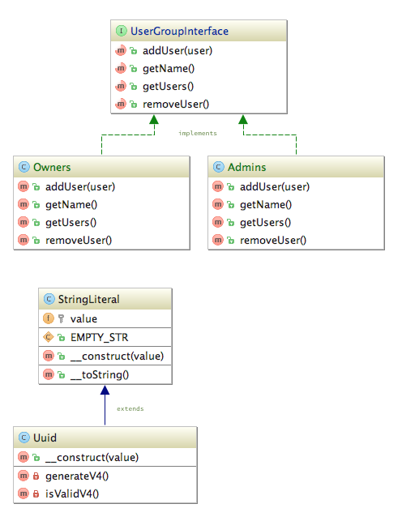

#FINAL-PROJECT (DELIVERABLE 2)

1. Review the existing class diagram we have for the notes-api application: 
2. Fill-in the class diagram with the necessary classes to support flexible permissions based on roles.  (We did discussed this in class on Tuesday, Nov. 10th) **5 points**
**NOTE:** Please use a PNG or PAINT editing application to add the new classes to *orig-class-diagram.png*
3. Write unit-tests for the classes you added in step #2. **5 points**
4. Write code that makes the unit-tests written in step #3 succeed. **10 points**

